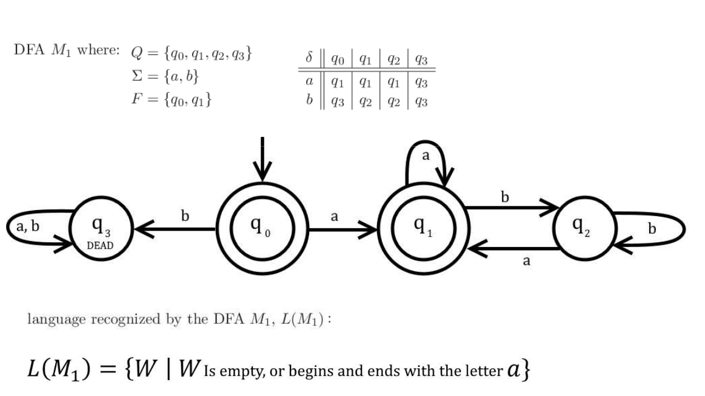
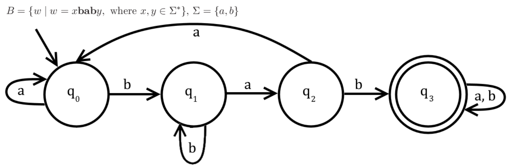

# nifty
A crate for generating Deterministic Finite State Automata in Rust.  

## Description

The goal of this crate is not to be an efficient parsing library. Use a regex for that.  
Rather, this crate aims to preserve the integrity of stepping through a DFA state diagram.   

It allows you to build a DFA with states of a generic type `S` that recognizes a language
whose symbols are of a generic type `T`. You can traverse each transition symbol one by one, or you can 
consume an iterator of symbols, which the DFA will either `Accept` or `Reject`.

DFAs are created using a `DFABuilder`, or by using the `make_dfa!` macro.
Both methods ensure that the DFA has valid transitions for every symbol in its alphabet.

## Examples

### Building a DFA



**Code**
```rust
use nifty::make_dfa;

fn main() {
    let q0 = "q0";
    let q1 = "q1";
    let q2 = "q2";
    let q3 = "q3";

    let mut dfa = make_dfa! {
        states { q0, q1, q2, q3 }
        accept { q0, q1 }
        start  { q0 }
        dead   { q3 }
        transitions {
            'a' => (q0, q1)
            'b' => (q0, q3)

            'a' => (q1, q1)
            'b' => (q1, q2)

            'a' => (q2, q1)
            'b' => (q2, q2)
        }
        recognizes { 
            "empty, or starts and ends with { a }"
        }
    };

    dbg!(&dfa);

    dbg!(dfa.evaluate("".chars()));
    dbg!(dfa.evaluate("a".chars()));
    dbg!(dfa.evaluate("b".chars()));
    dbg!(dfa.evaluate("aa".chars()));
    dbg!(dfa.evaluate("ab".chars()));
    dbg!(dfa.evaluate("abb".chars()));
    dbg!(dfa.evaluate("aba".chars()));
    dbg!(dfa.evaluate("abba".chars()));
    dbg!(dfa.evaluate("babba".chars()));
}
```

**Output**
```
[src/lib.rs:82] &dfa = DFA {
    recognizes: "empty, or starts and ends with { a }",
    states: {
        "q0",
        "q1",
        "q2",
        "q3",
    },
    accept_states: {
        "q0",
        "q1",
    },
    dead_states: {
        "q3",
    },
    goal_states: {},
    transitions: {
        'a': {
            "q0": "q1",
            "q1": "q1",
            "q2": "q1",
        },
        'b': {
            "q0": "q3",
            "q1": "q2",
            "q2": "q2",
        },
    },
    start: Some(
        "q0",
    ),
    current: "q0",
}


[src/main.rs:28] dfa.evaluate("".chars()) = Accept
[src/main.rs:29] dfa.evaluate("a".chars()) = Accept
[src/main.rs:30] dfa.evaluate("b".chars()) = Reject
[src/main.rs:31] dfa.evaluate("aa".chars()) = Accept
[src/main.rs:32] dfa.evaluate("ab".chars()) = Reject
[src/main.rs:33] dfa.evaluate("abb".chars()) = Reject
[src/main.rs:34] dfa.evaluate("aba".chars()) = Accept
[src/main.rs:35] dfa.evaluate("abba".chars()) = Accept
[src/main.rs:36] dfa.evaluate("babba".chars()) = Reject
```

### Tracing a Path



**Code**
```rust
use nifty::make_dfa;

fn main() {
    let q0 = "Seen { }";
    let q1 = "Seen { b }";
    let q2 = "Seen { ba }";
    let q3 = "Seen { bab }";

    let mut dfa = make_dfa! {
        states { q0, q1, q2, q3 }
        start  { q0 }
        goal   { q3 }
        transitions {
            'a' => (q0, q0) 
            'a' => (q1, q2) 
            'a' => (q2, q0) 

            'b' => (q0, q1) 
            'b' => (q1, q1) 
            'b' => (q2, q3) 
        }
        recognizes {
            "contains { bab }"
        }
    };  

    let path = "abaababa".chars()
        .map(|c| (c, dfa.get_next(&c)))
        .collect::<Vec<_>>();

    for tuple in &path {
        println!("{:?}", tuple);
    }   
}
```

**Output**
```text
('a', "Seen { }")
('b', "Seen { b }")
('a', "Seen { ba }")
('a', "Seen { }")
('b', "Seen { b }")
('a', "Seen { ba }")
('b', "Seen { bab }")
('a', "Seen { bab }")
```
